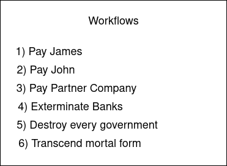
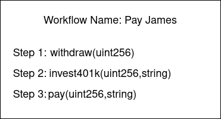
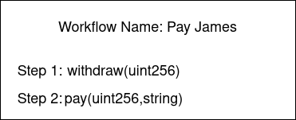
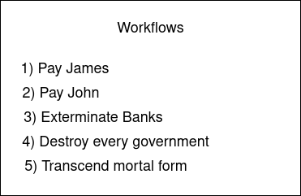

== Overview

The website should be a portal bridging the contracts and the user.

== Requirements

Note that the images are for visual purposes only to convey the idea.

. A user should be able to sign up with their meta mask wallet address

. A user should be able to sign into their system by connecting their wallet

. When signed in the user should be able to
.. View all of their workflows

.. The user should be able to create a new workflow
... The user must provide a human readable name for the workflow
... The user should be able to as many sections as they wish to the workflow
.... Each section should contain
..... A field to write the function with its data types e.g. `function pay(string,uint256)`
..... A contract address for the function to be called upon
..... Default values for the data types in the function e.g. string = "John", uint256 = 100. They must be separate from the function declaration field
.... Since the function with its data types will be used to create a function selector there needs to be validation to ensure that the pattern `function functionName(commaSeparatedDataTypesWithoutSpaces)` is met
.... Further validation is required on the data types and default values (where possible)
... The user should be able to remove a section
... The user should be able to select the order of the sections within the workflow
... The user should be able to save the workflow

. The user should be able to edit a workflow by
.. Changing the human readable name to a different unique human readable name
.. Changing the order of the sections
.. Changing any information within each section i.e.
... `function pay(string,uint256)` to `function profitShare(string,string,string,uint256)` etc.
... The default values for the data types
... The contract address associated with the section

. The user should be able to delete a workflow
.. Display relevant information about the workflow and ask for a confirmation to delete or cancel

. When a workflow is saved or edited the workflow ID should be (re)generated according
to the workflow ID generation specification

. Changing the name of the workflow does not affect its workflow ID

. The user should be able to order their workflows

. The user should be able to associate a workflow with a time for the scheduler

. The user should be able to remove a workflow from the scheduler

. The user should be able to edit the time for a workflow in the scheduler

. When the user tries to save their workflow it must first pass validation checks
and point out why it cannot save a workflow so that the user can edit their inputs

. Once the validation checks are passed for saving a workflow we must call out to
etherscan (or additional equivalents) where we can fetch the ABI of the contract address
.. If the ABI exists then we will check with the function selector (or the function name?) to see if it exists
... If it exists then we will perform gas estimation with the default values and store those values for later
... Else if the function is not found within the contract then we indicate to the user that the function does not exist in the way that they have entered it
.. Else if the ABI does not exists then we require some default values to indicate this

. To be able to execute a workflow the user must have sufficient ETH deposited to
their execution pool

. Everything is done on the client side for security. No node connections.

. Initially when the user is not signed in we will be calling the onboarding contract
to make decisions about logging in or signing up.

. Once a user is signed in we will communicate directly with their user controller until they sign out
at which point we will communicate with the onboarding contract again

== Possible future features?

. The user should be able to lock a workflow

. The user should be able to remove the lock from the workflow

. The user should be able to delete all workflows that are not locked
